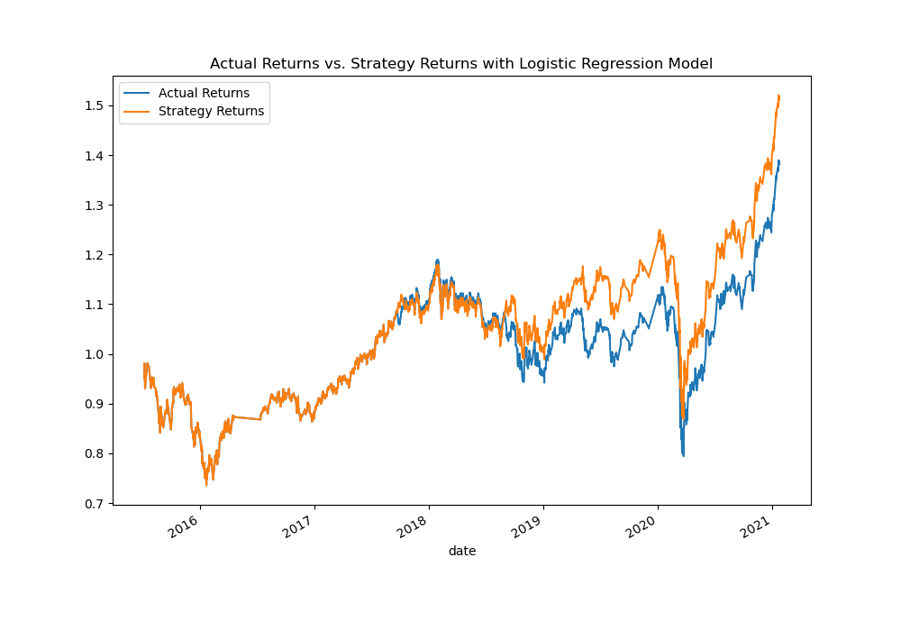

# Machine Learning Trading Algorithm Bot
## Tune the Baseline Trading Algorithm
### Step 1: Tune the training algorithm by adjusting the size of the training dataset.
#### What impact resulted from increasing or decreasing the training window?

### Step 2: Tune the trading algorithm by adjusting the SMA input features
#### What impact resulted from increasing or decreasing either or both of the SMA windows?

### Step 3: Choose the set of parameters that best improved the trading algorithm returns
#### Save a PNG image of the cumulative product of the actual returns vs. the strategy returns

