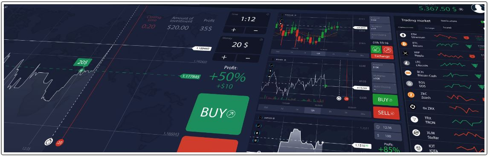
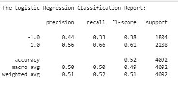
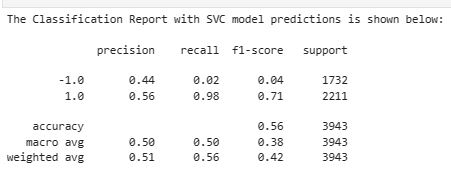
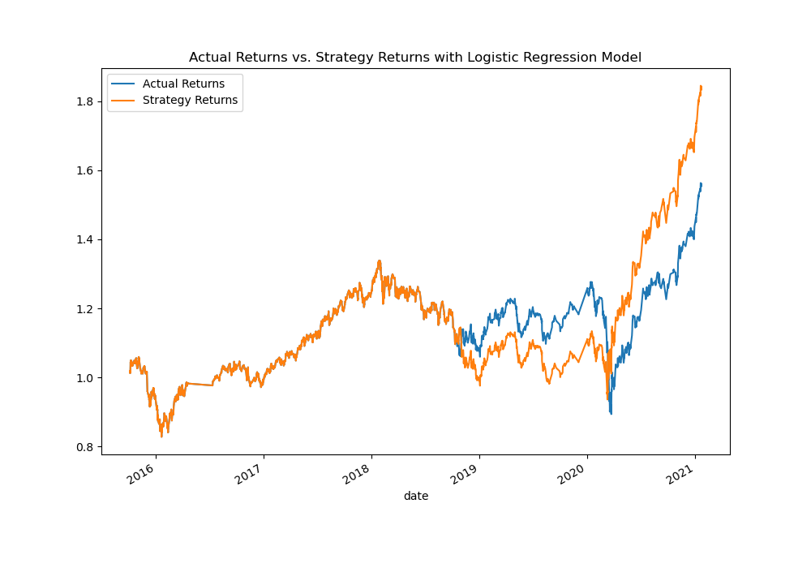

# Machine Learning Trading Algorithm Bot

## Tune the Baseline Trading Algorithm
### Step 1: Tune the training algorithm by adjusting the size of the training dataset. To do so, slice your data into different periods. Rerun the notebook with the updated parameters
#### Ending period for the training data with an offset of 3 months_

#### Ending period for the training data with an offset of 6 months_

#### What impact resulted from increasing or decreasing the training window?
The increase for training data with an offset of 6 months from 3 months gave us 56% accuracy using the SVC model slightly higher than the 52% accuracy of using logistic regression. Both have equal percentages on the precision for both buy (1.0) & sell (-1.0) signals however, the percentage on recall has widely increased to 98% on SVC model from the 66% for the logistic regression.

### Step 2: Tune the trading algorithm by adjusting the SMA input features
#### What impact resulted from increasing or decreasing either or both of the SMA windows?

There's a slight improvement in the predicting accuracy in both 1.0 and -1.0 after adjusting the the SMA input features. 
The cumulative return plots in all models however, shows that the SVC model with extended training dataset has the "Strategy Returns" performing considerably better than the "Actual Returns" as noticed around after the 1st quarter of 2020.

### Step 3: Choose the set of parameters that best improved the trading algorithm returns
#### Save a PNG image of the cumulative product of the actual returns vs. the strategy returns

